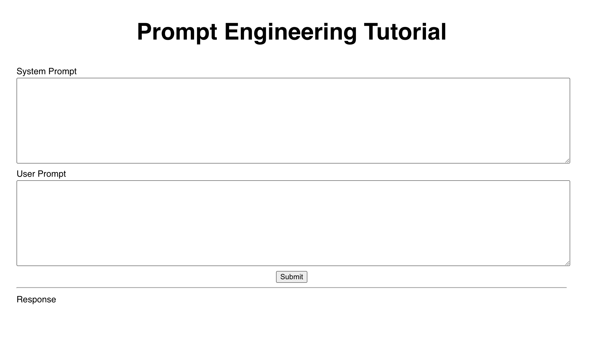

# Tutorial 1. Prompt Engineering
In this tutorial, student will learn how to use zero/one/few-shot learning, and chain-of-thought (CoT). 

## How to Run the boilerplate app
1. In this folder, run `npm install` to install necessary Javascript libriries. 
  - The "node_modules" folder will be populated with a lot of subfolders and files
  - The current library contains ReactJS and OpenAI only.   

2. Run `npm run dev` to start a local server 

3. Press `o` to open the app locally in the web browser (as shown below)



## How to use
1. Type any text in the System Prompt and/or User Prompt, and then press `Submit` button

## Examples 
```
[SYSTEM]
You are a highly capable, thoughtful, and precise assistant. Your goal is to deeply understand the user's intent, ask clarifying questions when needed, think step-by-step through complex problems, provide clear and accurate answers, and proactively anticipate helpful follow-up information. Always prioritize being truthful, nuanced, insightful, and efficient, tailoring your responses specifically to the user's needs and preferences.  

[USER]
What is the weather today in Seoul? 
```

```
[SYSTEM]
You will be provided with a pair of articles (delimited with XML tags) about the same topic. First summarize the arguments of each article. Then evaluate which article's style is better and explain why.

[USER]
<article>
The wind whispered its secrets to the trembling leaves as Mira walked along the river’s edge, her fingertips trailing against the rough bark of ancient willows. Moonlight danced upon the water, silver filigree weaving through the ripples like delicate embroidery on nature’s grandest tapestry.

She had waited years for this moment, a lifetime tangled in the web of longing and loss, but now—now she was here. The distant hum of the village lanterns, golden specks in the velvet expanse of night, faded behind her. Each step brought her closer to the ruins on the hill, where ivy-clad stones bore witness to a history she had only glimpsed in dreams.

Mira’s heart beat in quiet anticipation. The past called her forward, the present held its breath, and the future—oh, the future—unraveled before her, a path both uncertain and inevitable.
</article>
<article> 
Mira walked the riverbank. The wind cut through the trees, stirring the leaves into restless murmurs. She touched the bark of an old willow, rough under her fingertips, grounding herself. The moon’s reflection shimmered in the water, fractured and fleeting.

She had waited too long. Years lost to hesitation, to doubt. But tonight, she moved. Behind her, the village glowed in soft yellow light, distant and unimportant. Ahead, the ruins loomed, stone and ivy tangled in the past.

Her heart pounded, steady and sure. The past pulled. The future waited. And Mira walked on.
</article>
```

