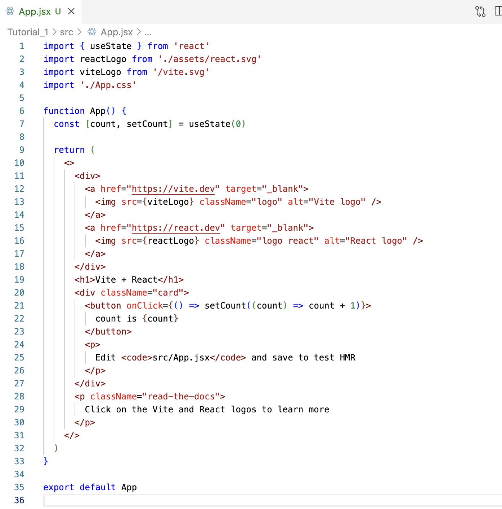
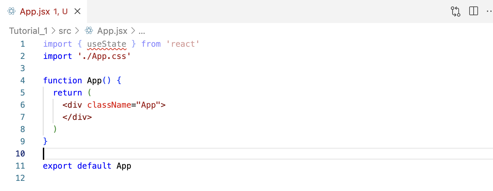

# Tutorial 1. Prompt Engineering
In this tutorial, student will learn how to use zero/one/few-shot learning, and chain-of-thought (CoT). 

## How to Run the boilerplate app
1. After you clone this repository, run `npm install` to install necessary Javascript libriries. 

2. Run `npm run dev` to start a local server

3. Press `o` to open the app locally in the web browser

## How to customize
1. Open `src/App.jsx`

- and remove unnecessary stuff as below
